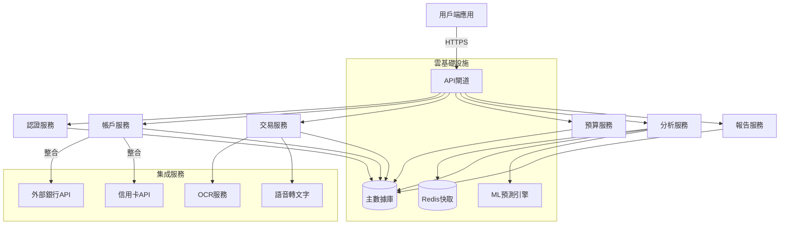
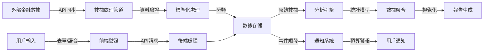
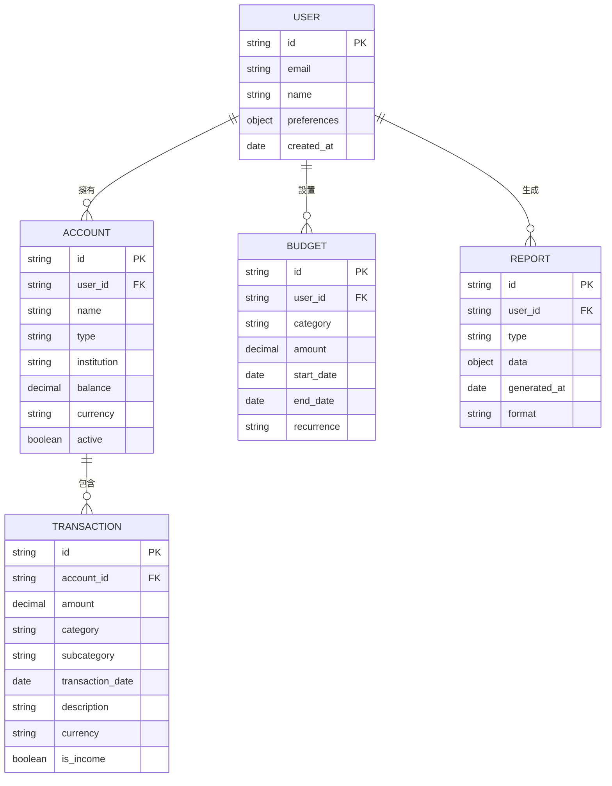
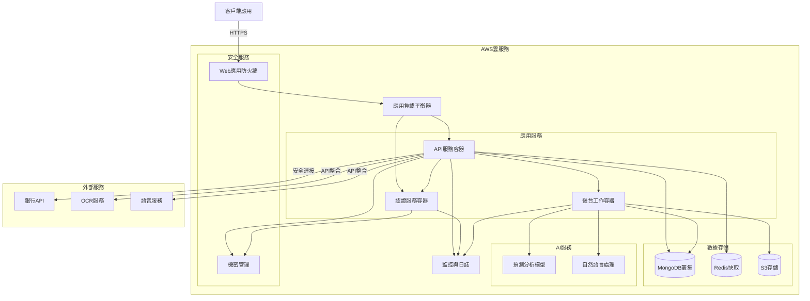

# 個人財務自動化系統 - 技術架構與實現方案

## 系統概述

個人財務自動化系統是一個跨平台應用，旨在幫助用戶整合多渠道財務數據、自動分類交易、提供預算管理和財務分析功能。系統採用現代化架構，確保數據安全、高性能和可擴展性。

## 系統架構

## 數據流設計

## 資料庫結構

## 部署架構

## 技術實現重點

### 安全性實現
- 採用OAuth 2.0與JWT實現用戶認證
- 所有資料傳輸使用TLS 1.3加密
- 敏感財務數據使用AES-256加密存儲
- 實施多因素認證保護用戶帳戶
- 定期安全審計和漏洞評估

### 效能優化
- 使用Redis快取頻繁訪問數據
- 實施資料庫查詢優化和索引策略
- 採用懶加載技術減少初始加載時間
- CDN分發靜態資源
- 服務器端渲染關鍵頁面

### AI功能實現
- 使用機器學習模型自動分類交易
- 基於歷史數據的支出預測模型
- 自然語言處理解析描述文本
- 異常交易檢測算法
- 個性化財務建議引擎

## 擴展性考量
- 微服務架構允許獨立擴展各功能模塊
- 容器化部署支持快速擴容
- 事件驅動設計降低系統耦合度
- API優先設計便於第三方集成
- 多區域部署支持全球用戶

這份技術文檔提供了個人財務自動化系統的架構藍圖，為開發團隊提供清晰的技術方向和實施指南，確保系統具備高安全性、良好性能、強大功能和未來擴展能力。