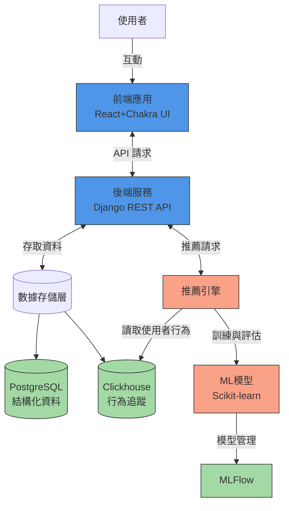
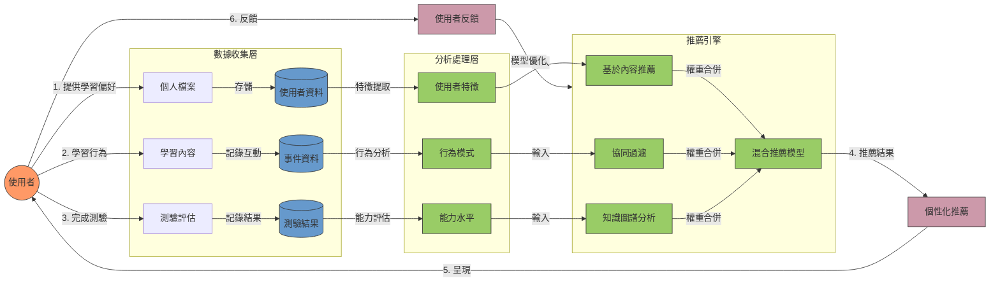
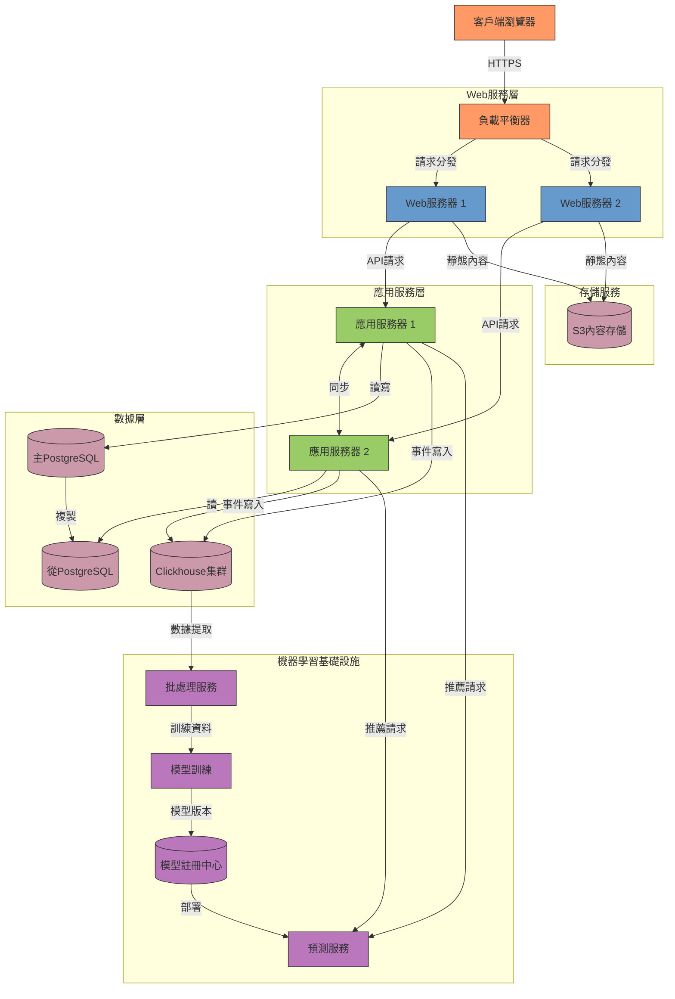

# 個人化學習推薦系統 - 功能規格概要

## 系統架構圖

## 數據流程圖

## 部署架構圖

## 關鍵功能實施優先順序

1. **基礎平台** (第一階段)：
   - 使用者註冊與驗證系統
   - 內容管理系統與分類標籤
   - 基本學習進度追蹤

2. **核心推薦功能** (第二階段)：
   - 詳細使用者行為追蹤
   - 基於內容的推薦演算法
   - 測驗結果分析與知識點評估

3. **進階推薦系統** (第三階段)：
   - 協同過濾推薦模型
   - 知識圖譜建構與路徑推薦
   - A/B測試框架與演算法優化

## 技術考量重點

- **可擴展性**：微服務架構設計，便於獨立擴展各功能模組
- **即時性**：使用Clickhouse高效處理大量使用者事件數據
- **算法性能**：實