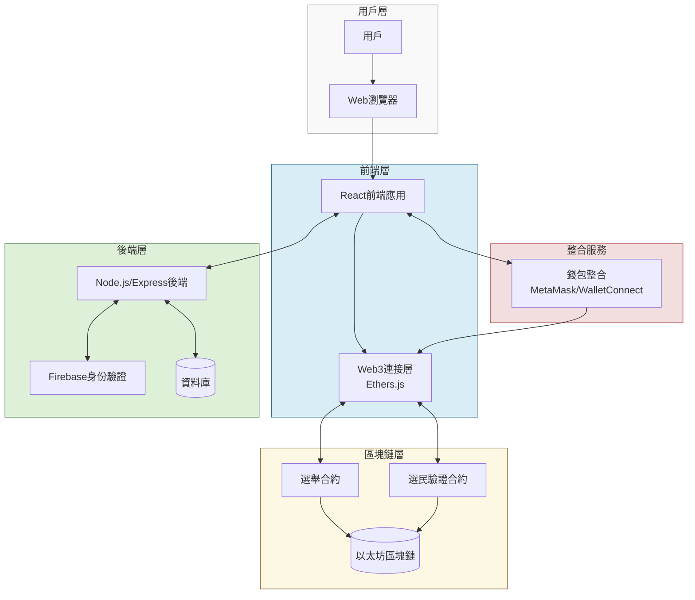
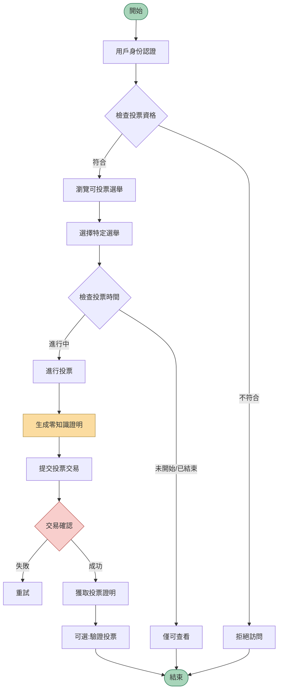
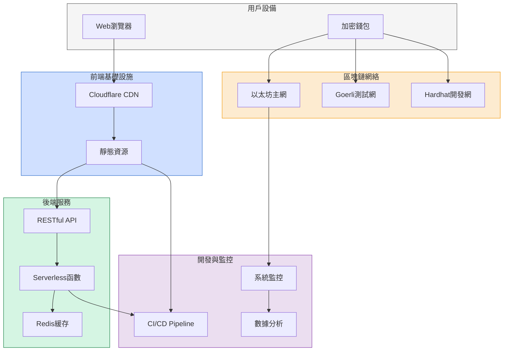

# 區塊鏈投票平台技術概覽文件

## 系統架構圖

## 投票流程圖

## 部署架構圖

## 關鍵技術摘要

### 智能合約架構

- **選舉合約**: 使用Solidity 0.8.x開發，實現ZK-Proof機制確保投票匿名性，支援多種投票類型和時間鎖定功能
- **選民驗證合約**: 整合Merkle樹驗證機制，實現高效的選民資格驗證與白名單管理

### 安全考量

1. **匿名性保護**: 採用零知識證明技術，確保投票記錄與身份分離
2. **投票完整性**: 區塊鏈不可篡改特性保證投票結果可靠性
3. **防重複投票**: 智能合約設計防止多次投票
4. **資安防護**: 全程HTTPS加密，定期進行合約審計和漏洞掃描

### 性能優化

- CDN加速靜態資源交付
- 使用Layer 2解決方案降低交易成本
- 服務器端緩存減少區塊鏈讀取操作
- 批量處理提高系統吞吐量

### 可擴展性設計

1. **模組化架構**: 便於新功能擴展
2. **跨鏈準備**: 預留跨鏈投票功能接口
3. **API版本控制**: 確保向後兼容性
4. **微服務設計**: 各組件獨立擴展

## 項目實施時程表

| 月份 | 主要里程碑 | 交付物 |
|------|----------|--------|
| 月份1 | 需求分析與架構設計 | 需求文檔、架構設計圖、技術選型報告 |
| 月份2-3 | 智能合約開發 | 合約代碼、單元測試、安全審計報告 |
| 月份3-4 | 前端開發 | UI原型、前端代碼、整合測試 |
| 月份4-5 | 後端開發與整合 | API文檔、後端服務、整合測試報告 |
| 月份6 | 系統測試與部署 | 測試報告、部署文檔、用戶手冊 |

此技術概覽包含了區塊鏈投票平台的核心架構、流程和技術細節，為開發團隊提供清晰的實施指南。