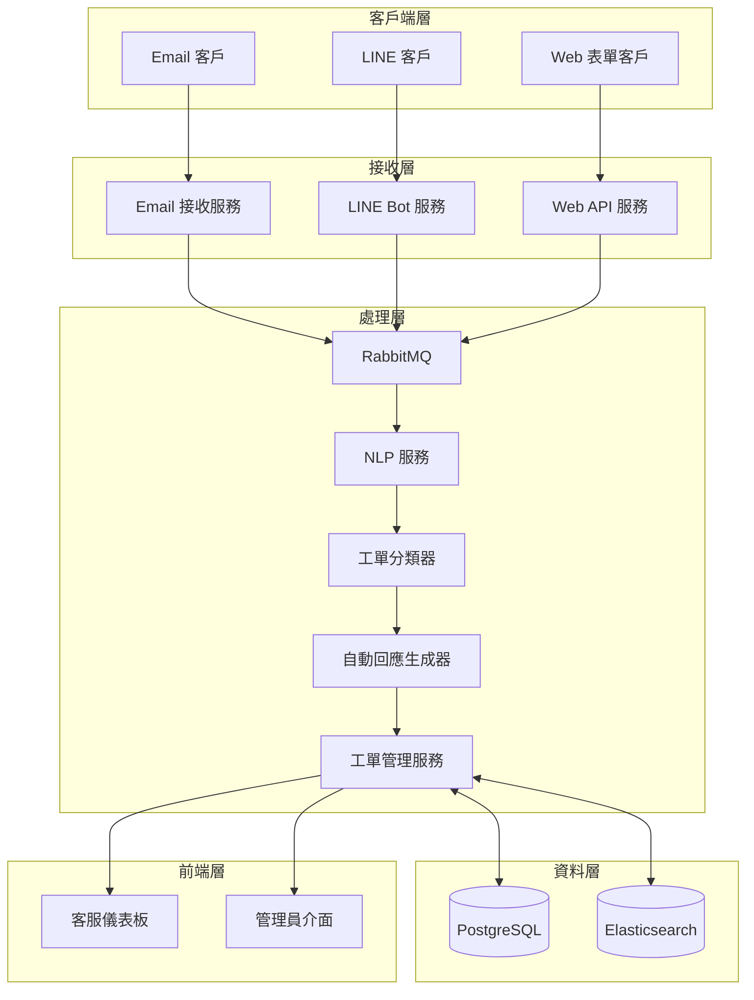
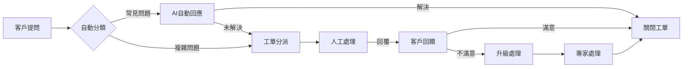
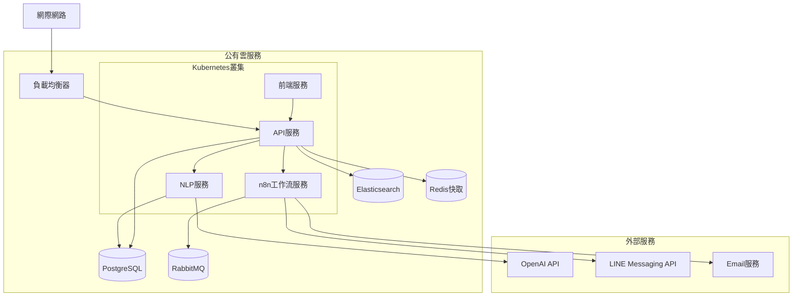

# AI 驅動的智慧客服中心技術規格概要

## 系統架構圖

## 資料流程圖

## 部署架構

## 重要技術特點

1. **微服務架構**：將系統拆分為獨立的服務，提高可擴展性與可維護性
2. **AI 驅動分類與回應**：使用 GPT-4 進行深度文本理解與生成
3. **多管道整合**：統一處理來自不同渠道的客戶請求
4. **自動化工作流**：使用 n8n 編排複雜的工單處理流程
5. **實時監控**：全面監控系統性能與工單處理狀態

## 系統優勢

- **效率提升**：自動處理高達 70% 的常見問題
- **一致性**：標準化回應確保服務質量
- **可擴展性**：隨工單量自動擴展處理能力
- **數據驅動**：提供完整分析報表優化客服流程
- **無縫整合**：與現有系統和通訊渠道整合

## 技術挑戰與解決方案

| 挑戰 | 解決方案 |
|-----|----------|
| 多語言支持 | 使用多語言 NLP 模型與翻譯服務 |
| 高峰期處理 | 實施自動擴展與請求節流 |
| 隱私合規 | 數據加密與匿名化處理 |
| AI 回應品質 | 人工審核與持續優化模型 |
| 系統整合 | 標準 API 與消息佇列解耦服務 |

此文件提供了 AI 驅動智慧客服中心系統的核心技術架構與實施概要，為開發團隊提供清晰的技術指導方向。