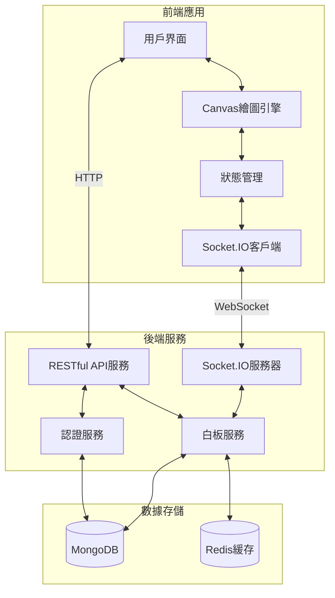
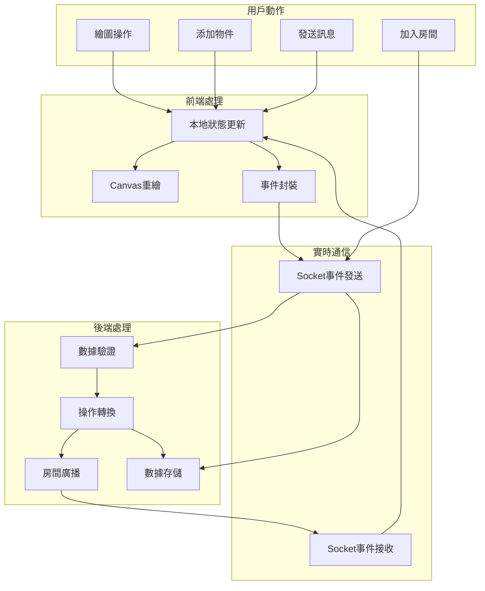
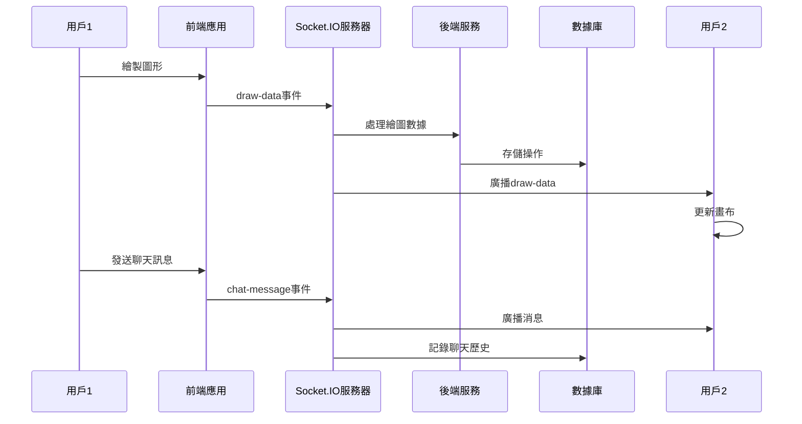

# 即時多人白板協作平台技術規格文件

## 專案架構概述

以下是即時多人白板協作平台的核心技術架構與數據流程。

### 系統架構圖



### 數據流程圖



## 技術規格詳解

### 1. 前端技術棧

| 技術元素 | 選擇方案 | 用途說明 |
|---------|---------|---------|
| 框架 | React + TypeScript | 提供類型安全和組件化開發 |
| 繪圖引擎 | Canvas API | 高效繪圖與渲染 |
| 狀態管理 | Zustand | 輕量級狀態管理，易於整合WebSocket |
| UI庫 | Chakra UI | 現代化UI組件，支持深色模式 |
| 實時通信 | Socket.IO | 可靠的雙向實時通信 |

### 2. 後端技術棧

| 技術元素 | 選擇方案 | 用途說明 |
|---------|---------|---------|
| 服務器框架 | Node.js + Express | 高性能非阻塞I/O，適合實時應用 |
| 實時服務 | Socket.IO | 服務端事件處理與廣播 |
| 數據庫 | MongoDB | 存儲白板內容與用戶數據 |
| 緩存系統 | Redis | 房間狀態管理和會話存儲 |
| 認證系統 | JWT | 無狀態認證機制 |

### 3. 關鍵API事件



### 4. 部署架構

```mermaid
flowchart TB
    subgraph "客戶端"
        Browser[用戶瀏覽器]
    end
    
    subgraph "CDN"
        CDN[內容分發網絡]
    end
    
    subgraph "負載均衡"
        LB[負載均衡器]
    end
    
    subgraph "應用集群"
        API1[API服務器1]
        API2[API服務器2]
        Socket1[Socket服務器1]
        Socket2[Socket服務器2]
    end
    
    subgraph "數據層"
        RedisCluster[(Redis叢集)]
        MongoReplica[(MongoDB複製集)]
    end
    
    Browser <--> CDN
    Browser <--> LB
    LB --> API1 & API2
    LB --> Socket1 & Socket2
    API1 & API2 <--> RedisCluster
    API1 & API2 <--> MongoReplica
    Socket1 & Socket2 <--> RedisCluster
    Socket1 & Socket2 <--> MongoReplica
```

## 關鍵技術挑戰與解決方案

### 1. 即時協作衝突處理
使用操作轉換(OT)算法處理並發編輯，確保所有用戶看到一致的白板狀態。操作以時間戳和用戶ID標記，服務器負責解決衝突並廣播最終結果。

### 2. 網絡延遲與斷連處理
- 實現樂觀更新策略，本地立即反饋
- 使用操作隊列緩存離線操作
- 重連後自動同步最新白板狀態

### 3. 大型白板性能優化
- 實現視口渲染，僅渲染可見區域
- 對象分層處理，減少重繪範圍
- 使用WebWorkers處理複雜計算

### 4. 擴展性設計
系統設計為水平擴展架構，可根據用戶量動態增加服務器節點。Redis用於服務器間共享會話狀態，確保用戶可連接到任何服務器節點繼續工作。

## 安全性考量

1. **數據傳輸安全**：全站HTTPS，WebSocket使用WSS
2. **用戶認證**：JWT結合短期訪問令牌
3. **操作授權**：細粒度白板編輯權限控制
4. **輸入驗證**：全面防範XSS和注入攻擊

此技術規格提供了即時多人白板協作平台的核心架構設計，著重於系統的可靠性