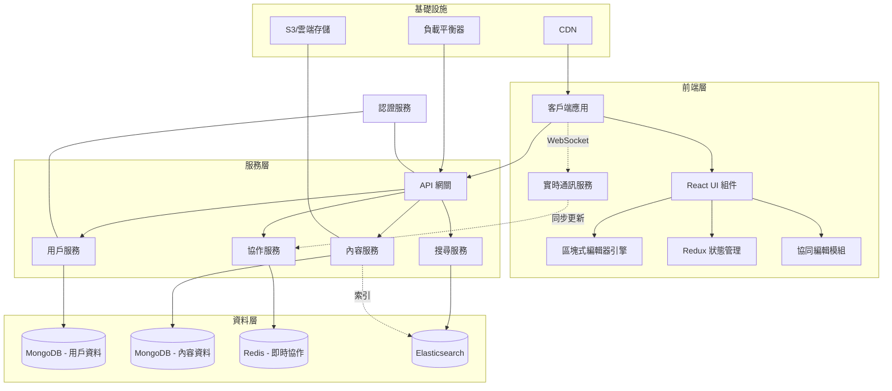
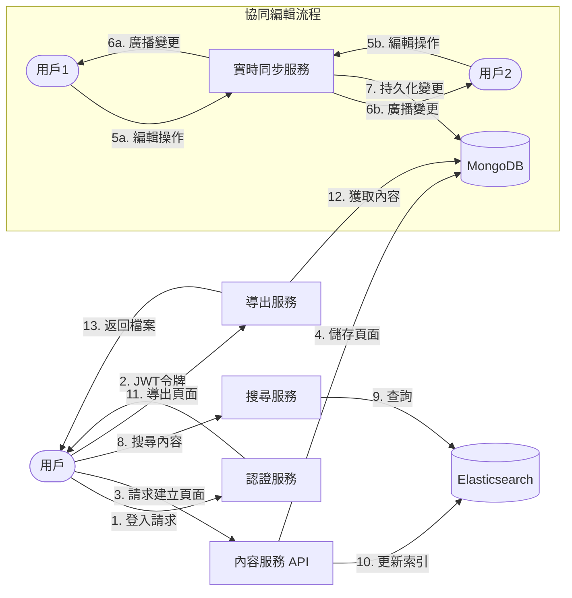
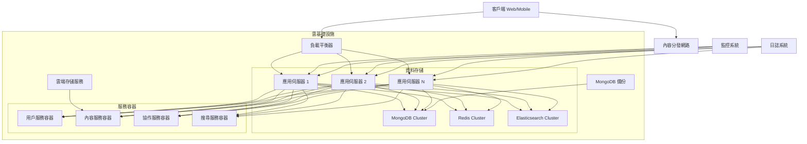
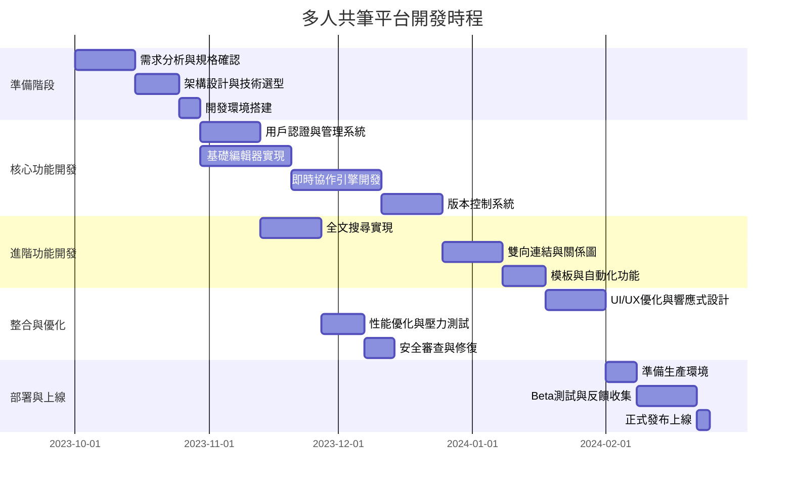

# 多人共筆式知識管理平台 - 軟體開發規格文件

## 系統架構圖

## 資料流程圖

## 部署架構圖

## 技術選型表

| 元件類型 | 選用技術 | 用途說明 |
|----------|----------|----------|
| 前端框架 | React.js + TypeScript | 構建互動式、組件化的用戶界面 |
| 狀態管理 | Redux + Redux Toolkit | 管理應用狀態與數據流 |
| 協作引擎 | CRDT (Conflict-free Replicated Data Type) | 實現無衝突的即時協作編輯 |
| API 風格 | GraphQL | 靈活查詢，減少網路負載 |
| 後端框架 | Node.js + Express.js | 高性能非同步API服務 |
| 主數據庫 | MongoDB | 存儲結構彈性的文檔數據 |
| 緩存系統 | Redis | 會話管理、實時數據與高速緩存 |
| 搜尋引擎 | Elasticsearch | 全文檢索與知識圖譜查詢 |
| 消息佇列 | RabbitMQ | 服務間通信與任務分派 |
| 容器化   | Docker + Kubernetes | 服務打包與編排管理 |
| CI/CD    | GitHub Actions | 自動化測試與部署 |
| 監控系統 | Grafana + Prometheus | 性能監控與系統警報 |

## 系統實現時程規劃

## 結論