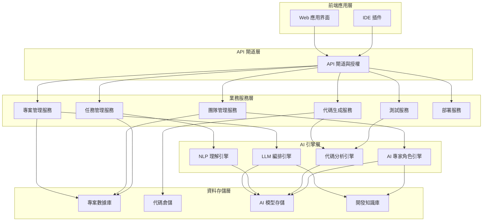

# 技術文件：AI 協作式程式開發平台架構設計

## 目錄
1. [專案概述](#專案概述)
2. [系統架構](#系統架構)
3. [核心子系統](#核心子系統)
4. [資料流程](#資料流程)
5. [部署架構](#部署架構)
6. [安全架構](#安全架構)
7. [擴展性考量](#擴展性考量)
8. [技術選型](#技術選型)
9. [附錄：系統圖表](#附錄系統圖表)

## 專案概述

「AI 協作式程式開發平台」是一個創新型開發環境，旨在透過 AI 技術模擬完整的開發團隊協作。本平台將 AI 技術與軟體開發流程深度整合，建立虛擬開發團隊，協助使用者從需求分析到程式實作、測試和部署的完整軟體開發生命週期。

本文件詳細說明系統架構設計，包含主要模組、資料流、部署方案及技術選型。

### 關鍵目標
- 打造能模擬專業開發團隊的 AI 虛擬團隊系統
- 建立高效的專案管理與任務分配機制
- 實現 AI 模型與軟體開發專業知識的深度整合
- 提供直覺的使用者介面與協作體驗
- 確保系統的安全性、可擴展性與性能

## 系統架構

### 總體架構

本系統採用微服務架構，分為前端應用層、API 閘道層、業務服務層、AI 引擎層及資料存儲層。



## 核心子系統

### 1. 專案管理子系統

專案管理子系統負責處理專案的建立、配置、進度追蹤等功能。

**主要元件：**
- 專案設定管理器：處理專案基本設定
- 時間線管理器：處理專案時程與里程碑
- 進度追蹤引擎：實時監控任務與專案進度
- 報表生成器：生成專案儀表板與報告

### 2. AI 虛擬團隊子系統

AI 虛擬團隊子系統負責不同 AI 角色的創建、管理及協調。

**主要元件：**
- 角色模型管理器：維護各專業角色的知識模型
- 角色個性引擎：定義不同 AI 專家的行為特性
- 團隊協調器：管理 AI 角色之間的合作與溝通
- 專業領域知識庫：各技術領域的專業知識存儲

### 3. 智能需求分析子系統

智能需求分析子系統負責理解用戶需求並轉換為規格文件。

**主要元件：**
- 需求解析器：處理自然語言需求描述
- 規格生成器：轉換需求為正式規格文件
- 需求補全引擎：填充需求細節與邏輯
- 衝突檢測器：識別需求之間的矛盾與衝突

### 4. 代碼生成與管理子系統

代碼生成與管理子系統負責產生、管理與版本控制系統代碼。

**主要元件：**
- 代碼生成引擎：根據需求與設計生成代碼
- 代碼結構管理器：維護代碼結構與整潔性
- 版本控制整合器：與 Git 等系統整合
- 代碼優化引擎：改進代碼質量與性能

### 5. 測試與質量保證子系統

測試與質量保證子系統負責自動化測試與代碼質量評估。

**主要元件：**
- 測試案例生成器：自動產生測試案例
- 自動化測試引擎：執行各類型的自動化測試
- 代碼質量分析器：評估代碼質量與識別問題
- 回歸測試管理器：管理回歸測試流程

## 資料流程

以下圖表展示系統主要資料流程：

```mermaid
flowchart TD
    subgraph "需求處理"
        A[用戶輸入需求] --> B[需求解析與結構化]
        B --> C[需求轉換為任務]
    end
    
    subgraph "任務分配"
        C --> D[任務分析與拆分]
        D --> E[分配給AI專家角色]
    end
    
    subgraph "設計階段"
        E --> F1[架構設計] & F2[UI設計] & F3[API設計]
        F1 & F2 & F3 --> G[設計審核與優化]
    end
    
    subgraph "開發階段"
        G --> H1[前端代碼生成] & H2[後端代碼生成]
        H1 & H2 --> I[代碼整