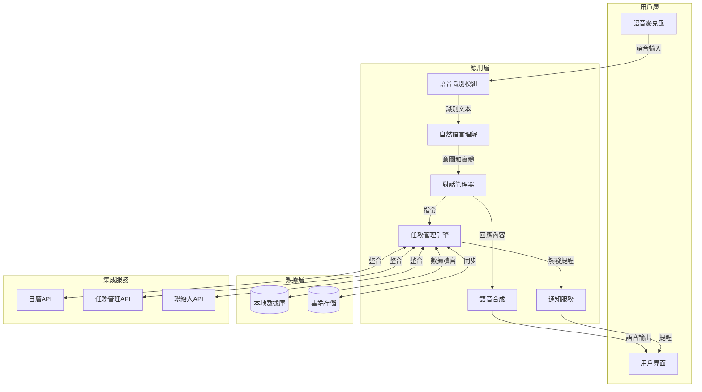
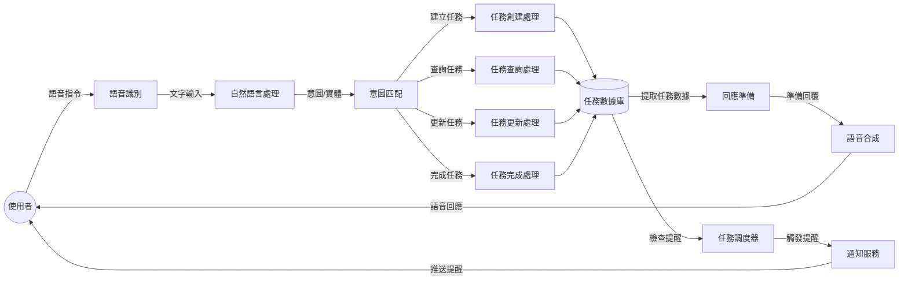
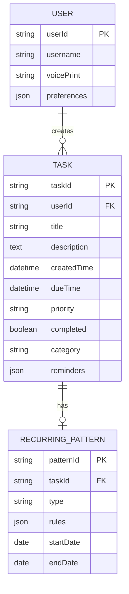
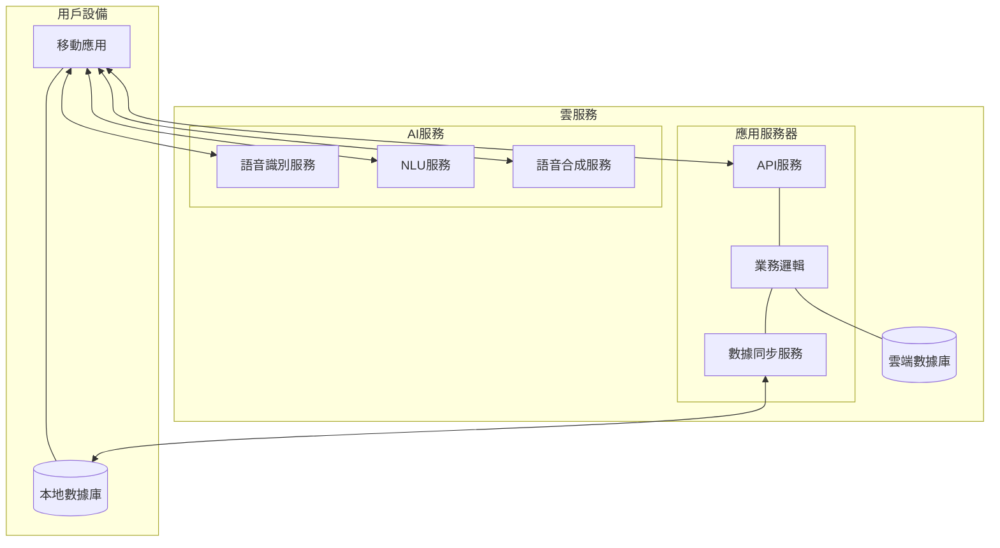

# 語音驅動的任務系統：技術架構與設計

## 系統架構概述

語音驅動的任務系統是一款結合語音識別、自然語言處理與任務管理功能的生產力工具，允許使用者通過語音指令完成任務管理操作。本文檔描述該系統的技術架構設計。

## 系統架構圖

## 數據流程圖

## 技術組件詳細說明

### 1. 語音識別模組 (ASR)

- **技術選型**：
  - 主要：Google Speech-to-Text API
  - 備選：百度語音識別、Microsoft Speech Service
- **功能**：
  - 實時語音轉文字
  - 支援多語言識別（中、英文優先）
  - 降噪處理與環境適應
- **性能指標**：
  - 安靜環境下識別準確率 > 95%
  - 輕度噪聲環境下準確率 > 85%
  - 平均識別延遲 < 300ms

### 2. 自然語言理解模組 (NLU)

- **技術選型**：
  - 主要框架：Rasa NLU / Dialogflow
  - 模型：BERT/GPT基礎預訓練模型微調
- **核心功能**：
  - 意圖分類（創建、查詢、修改、刪除任務）
  - 實體識別（時間、地點、人物、優先級）
  - 上下文管理（多輪對話支持）
- **技術指標**：
  - 意圖識別準確率 > 90%
  - 實體提取準確率 > 90%
  - 處理時間 < 200ms

### 3. 任務管理引擎

- **核心功能**：
  - CRUD任務操作
  - 時間管理與優先級排序
  - 任務過濾與分類
  - 週期性任務處理
- **技術選型**：
  - 自定義業務邏輯層
  - 事件驅動架構
- **數據模式**：見下文數據架構

### 4. 數據存儲架構

**本地數據庫模式**：

### 5. 系統部署架構

## 技術挑戰與解決方案

### 1. 語音識別準確性

**挑戰**：各種環境噪聲下保持高識別準確率

**解決方案**：
- 實現多麥克風陣列進行空間濾波
- 自適應環境噪聲消除算法
- 音頻預處理模組（降噪、回聲消除）
- 使用者可訓練模組以適應特定口音

### 2. 離線功能支持

**挑戰**：確保核心功能在無網絡環境下可用

**解決方案**：
- 輕量級本地語音識別模型
- 核心NLU處理在本地進行
- 本地-雲端數據同步機制
- 待連接狀態的操作排隊處理

### 3. 電池消耗優化

**挑戰**：連續語音監聽會大